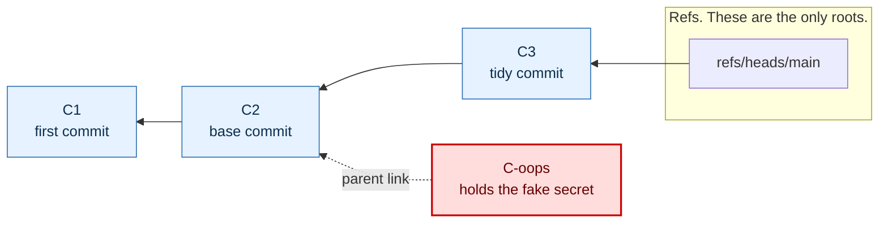
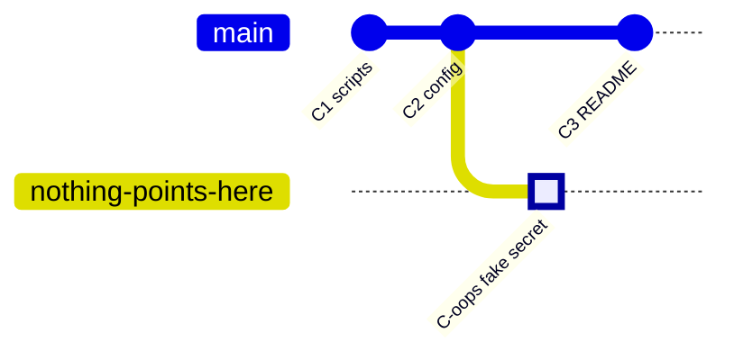
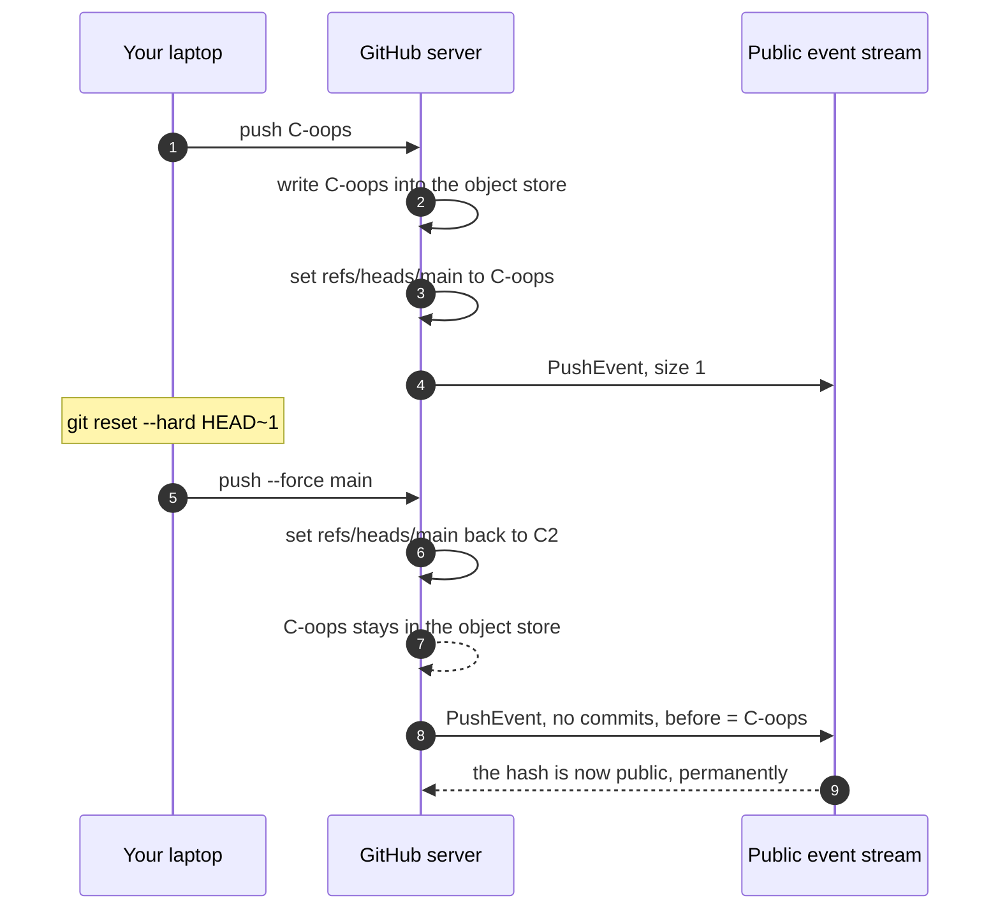
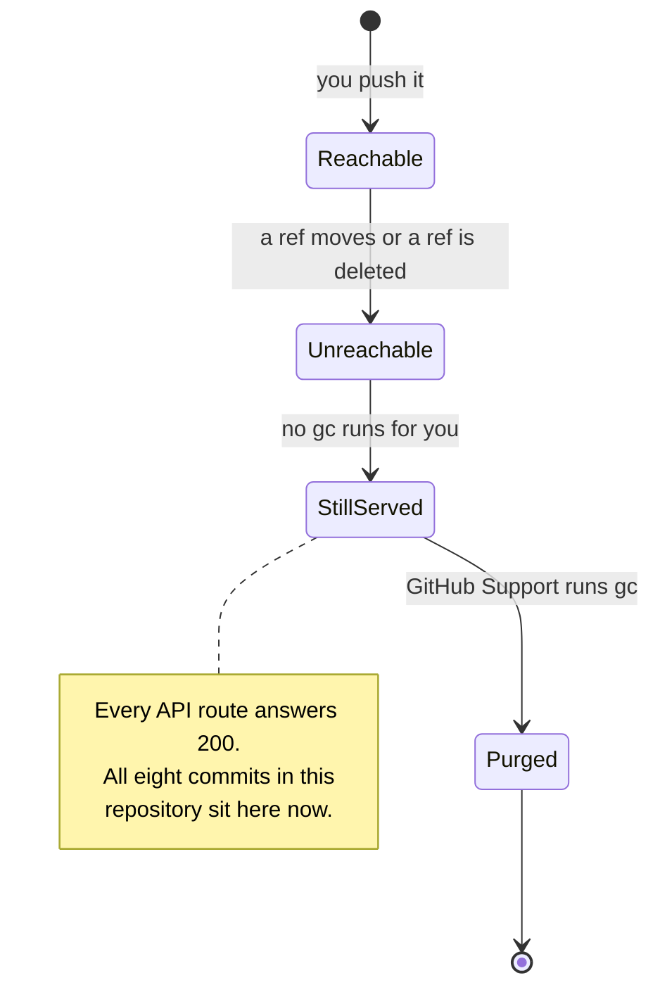
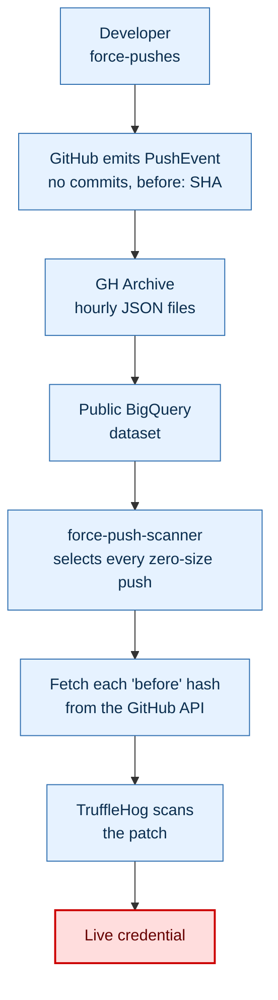
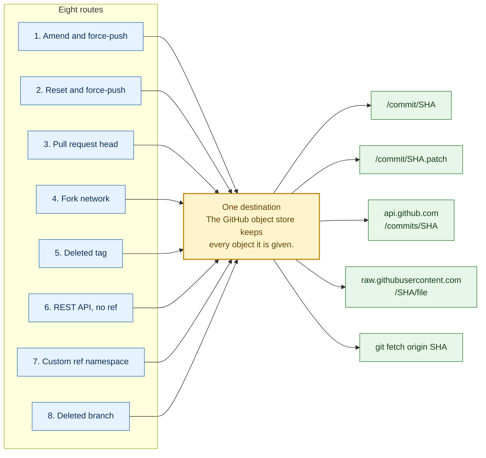
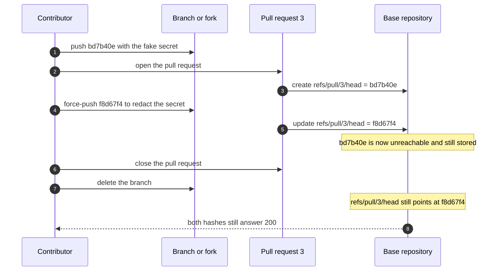
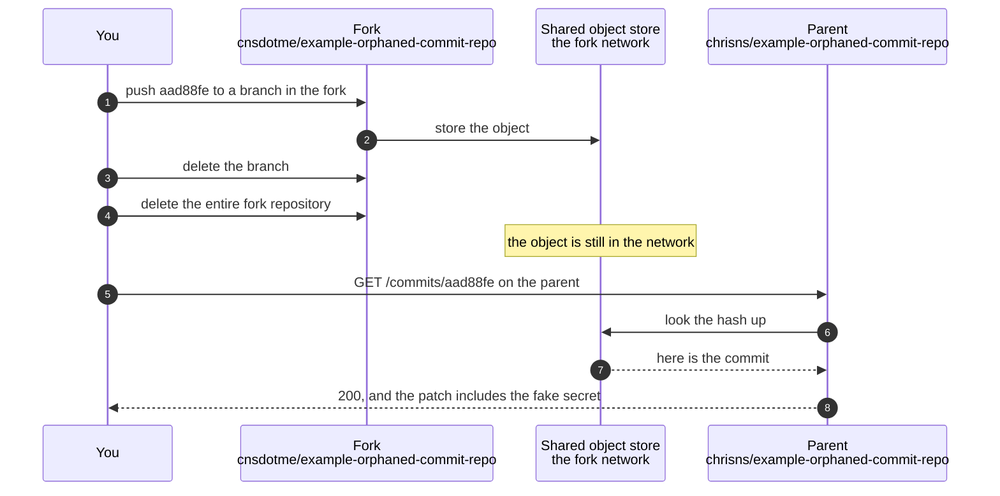

# What an orphaned commit looks like

This repository made its own orphaned commits on purpose. It then proved that GitHub still serves them.

An orphaned commit is a commit that no branch, tag or other ref can reach. On your laptop, Git eventually
deletes such a commit. On GitHub, it stays. Anyone who learns the commit hash can read the whole commit,
including any secret inside it.

Eight commits are listed below. Every one of them is orphaned right now. Not one of them appears in a full
clone of this repository. Every one of them still answers with HTTP 200 from the GitHub API. Click any link
and read the leaked file.

> [!NOTE]
> Every "secret" in this repository is the fixed string `EXAMPLE_NOT_A_REAL_SECRET_0000`.
> It is not a credential. It never was one. It grants access to nothing.

## The live evidence

| id | orphaned commit | how it became orphaned | in a full clone | GitHub API |
|----|-----------------|------------------------|-----------------|------------|
| `01-amend` | [`1f06319ff3`](https://github.com/chrisns/example-orphaned-commit-repo/commit/1f06319ff3f1edb1bee3938b105b253b1fc861fd) | `git commit --amend` then `git push --force` | absent | 200 |
| `02-reset` | [`8a665f4e9a`](https://github.com/chrisns/example-orphaned-commit-repo/commit/8a665f4e9a66c6819a33e73132caa2c3e2f93acc) | `git reset --hard HEAD~1` then `git push --force` | absent | 200 |
| `03-pr-first` | [`bd7b40ec8e`](https://github.com/chrisns/example-orphaned-commit-repo/commit/bd7b40ec8e2b00f8abdc9140084e56818b521b17) | force-push inside an open pull request | absent | 200 |
| `03-pr-final` | [`f8d67f4ddd`](https://github.com/chrisns/example-orphaned-commit-repo/commit/f8d67f4ddd1185182a3dfe3ef8d5274d452419e9) | pull request closed, branch deleted | absent | 200 |
| `04-fork` | [`aad88fed2e`](https://github.com/chrisns/example-orphaned-commit-repo/commit/aad88fed2eb33c0dabcae19819984234e33e47bd) | pushed to a fork, then the whole fork was deleted | absent | 200 |
| `05-tag` | [`49c1bf56d0`](https://github.com/chrisns/example-orphaned-commit-repo/commit/49c1bf56d078bf4d44efb471740a8d60de574150) | carried by a tag, then the tag was deleted | absent | 200 |
| `06-api` | [`c6b5e81903`](https://github.com/chrisns/example-orphaned-commit-repo/commit/c6b5e81903a85f44afd735564df0b56c23d48852) | written by the REST API, never had a ref at all | absent | 200 |
| `07-hidden` | [`fb57b1d73c`](https://github.com/chrisns/example-orphaned-commit-repo/commit/fb57b1d73cced97ea2a15acb51b585d3cffab00e) | pushed to `refs/hidden/stash`, then the ref was deleted | absent | 200 |

Run [`scripts/verify.sh`](scripts/verify.sh) to rebuild that table yourself. A
[scheduled workflow](.github/workflows/verify.yml) runs it every week. The workflow fails if GitHub ever
forgets one of these commits.

---

## Part 1. What "orphaned" means

Git stores commits in a content-addressed object store. Refs are the only roots. A ref is a branch, a tag, or
any other entry under `refs/`. A commit is reachable when you can walk to it from a ref by following parent
links. A commit is orphaned when you cannot.



`C-oops` still points at its parent. Nothing points at `C-oops`. The arrows only run one way, so no walk from
`refs/heads/main` can arrive there. The commit is orphaned.

The object itself did not move. It is still a file in the object store. Only the path to it disappeared.

## Part 2. The simplest route, in five commands

This is the route that the Truffle Security post calls an "oops commit". A developer commits a secret, pushes,
notices the mistake, and rewrites history.

```bash
git add credentials.txt
git commit -m "Oops: commit credentials by mistake"
git push origin main          # GitHub now owns the commit object, forever
git reset --hard HEAD~1       # the local branch forgets it
git push --force origin main  # the remote branch forgets it too
```

[`scripts/02-force-push-reset.sh`](scripts/02-force-push-reset.sh) contains exactly those commands. It produced
commit [`8a665f4e9a`](https://github.com/chrisns/example-orphaned-commit-repo/commit/8a665f4e9a66c6819a33e73132caa2c3e2f93acc).

The `git push` on line three is the step that matters. After that push, the commit exists on a server you do
not control. The two commands after it only edit a pointer.



The diagram draws a branch called `nothing-points-here`, because a Git graph needs a line to draw. No such
branch exists. That is the point. Remove the branch label in your head and the commit floats free.

### What each side does during a force-push



Step 9 is the leak. The force-push does not hide the old hash. It publishes it.

## Part 3. Why your laptop forgets and GitHub does not

Two things clean up unreachable objects on your laptop. The reflog holds the old hash for 90 days by default.
After that, `git gc` prunes the object. You can do it today instead. Run `git reflog expire --expire=now --all`
and then `git gc --prune=now`.

GitHub does not do this for you. You cannot run garbage collection on a GitHub repository, and you cannot
schedule it. Treat every object you have ever pushed as permanent.



## Part 4. How to read an orphaned commit

Each method below was run against this repository. None of them is assumed.

| method | command or URL | result |
|--------|----------------|--------|
| REST API | `gh api repos/OWNER/REPO/commits/SHA` | full commit, message and patch |
| REST API, short hash | `gh api repos/OWNER/REPO/commits/8a66` | resolves from four characters |
| Web page | `https://github.com/OWNER/REPO/commit/SHA` | rendered diff |
| Patch file | `https://github.com/OWNER/REPO/commit/SHA.patch` | a patch that `git am` accepts |
| Diff file | `https://github.com/OWNER/REPO/commit/SHA.diff` | unified diff |
| Raw file | `https://raw.githubusercontent.com/OWNER/REPO/SHA/credentials.txt` | the file body alone |
| Git protocol | `git fetch origin SHA` | the object, over plain Git |

The Git protocol case surprises people. GitHub allows a fetch of an unreachable object by its exact hash.

```bash
git clone --filter=blob:none --no-checkout https://github.com/chrisns/example-orphaned-commit-repo.git
cd example-orphaned-commit-repo
git fetch origin 8a665f4e9a66c6819a33e73132caa2c3e2f93acc
git cat-file -p 8a665f4e9a66c6819a33e73132caa2c3e2f93acc
```

### What does not find them

These methods give a false sense of safety.

| method | result |
|--------|--------|
| `git clone` | the orphan is absent |
| `git log --all` after a normal clone | the orphan is absent |
| `git ls-remote origin` | the orphan hash does not appear |
| The branch and tag lists in the web UI | nothing to see |

One trick does recover a whole class of them. The command below fetches every ref, including pull request
heads.

```bash
git -c "remote.origin.fetch=+refs/*:refs/remotes/origin/*" fetch origin
```

On this repository that command returns `refs/remotes/origin/pull/3/head`. That ref is commit
[`f8d67f4ddd`](https://github.com/chrisns/example-orphaned-commit-repo/commit/f8d67f4ddd1185182a3dfe3ef8d5274d452419e9).
Its branch was deleted and its pull request was closed. The ref survived both.

## Part 5. How people find them at scale

You do not need to know the hash. GitHub publishes it for you.

A force-push that removes commits emits a `PushEvent` that carries no commits. Historical GH Archive records
show this as `"size": 0`. The current API omits the `size` and `commits` fields instead. Either way, the
`before` field holds the hash of the commit that was just abandoned.

This is the real event from this repository, captured by
[`scripts/08-capture-events.sh`](scripts/08-capture-events.sh):

```json
{
  "type": "PushEvent",
  "created_at": "2026-09-21T10:21:43Z",
  "repo": "chrisns/example-orphaned-commit-repo",
  "payload": {
    "ref": "refs/heads/main",
    "head": "1e7bef539fc866bfd132f5b4835871ea7d85445c",
    "before": "8a665f4e9a66c6819a33e73132caa2c3e2f93acc"
  }
}
```

That `before` value is orphan `02-reset` from the evidence table. GitHub published the hash of the commit that
the force-push was meant to bury. The full record is in [`evidence/push-events.jsonl`](evidence/push-events.jsonl).

The GH Archive project stores the whole public event stream as hourly JSON files. It also mirrors the stream
into a public BigQuery dataset. So the abandoned hashes are queryable in bulk, back to 2011.



Sharon Brizinov ran that pipeline across every public repository. It earned 25,000 US dollars in bug bounties.
The write-up is
[How I Scanned all of GitHub's "Oops Commits" for Leaked Secrets](https://trufflesecurity.com/blog/guest-post-how-i-scanned-all-of-github-s-oops-commits-for-leaked-secrets).

The cost of this work is low. The archive is free. The API allows 5,000 requests per hour with a token. A scan
of one organisation takes minutes.

---

## Part 6. The other routes

Force-pushing is the famous route. It is not the only one. Some of the others leave no local trace at all.



### Route 3. Pull request heads outlive the pull request

GitHub keeps the head of every pull request under `refs/pull/N/head`. That ref belongs to the base repository,
not to the contributor. You cannot delete it. Closing the pull request does not delete it. Deleting the source
branch does not delete it. Deleting the whole fork does not delete it.

A force-push inside an open pull request is worse again. The old head becomes unreachable. The pull request
timeline then prints the abandoned hash as a permanent record.



See [`scripts/03-pull-request-head.sh`](scripts/03-pull-request-head.sh). Both hashes are in the evidence table.

### Route 4. The fork network shares one object store

A fork does not copy the objects. A fork joins a network that shares them. So a commit pushed to any member of
the network is readable through any other member, by hash.

This is the most counter-intuitive route. The commit was never pushed to the repository that serves it.



That sequence is not a thought experiment. This repository ran it. The fork
`cnsdotme/example-orphaned-commit-repo` was created, given the commit, and then deleted in full. Commit
[`aad88fed2e`](https://github.com/chrisns/example-orphaned-commit-repo/commit/aad88fed2eb33c0dabcae19819984234e33e47bd)
still resolves against the parent. Truffle Security names this class of problem Cross Fork Object Reference.

The practical warning is blunt. You fork a repository, push a secret, and delete your fork. The owner of the
parent repository can still read your secret. So can anyone that owner tells.

### Route 5. A tag is enough

A commit never has to touch a branch. Push a tag and GitHub has the object.

```bash
git commit -m "Release candidate build artefacts"
git tag --no-sign demo-rc-1
git push origin demo-rc-1              # the object is now on GitHub
git push origin :refs/tags/demo-rc-1   # the tag is gone, the object is not
```

Commit [`49c1bf56d0`](https://github.com/chrisns/example-orphaned-commit-repo/commit/49c1bf56d078bf4d44efb471740a8d60de574150)
came from [`scripts/05-deleted-tag.sh`](scripts/05-deleted-tag.sh). It has never been an ancestor of any branch.

This route matters because release tooling pushes tags. A CI job that tags a build directory can hand GitHub a
tree that no branch review ever saw.

### Route 6. A commit that was born orphaned

The REST Git Data API writes blobs, trees and commits as separate calls. Updating a ref is a fourth call. Skip
the fourth call and you create a commit that never had a ref.

No push happens. No force-push happens. No `PushEvent` is emitted, so the pipeline in Part 5 never sees it. The
commit is invisible to the branch list, to the network graph and to every clone. It still resolves.

```bash
BLOB=$(printf 'API_TOKEN=EXAMPLE_NOT_A_REAL_SECRET_0000\n' \
  | jq -Rs '{encoding:"utf-8", content:.}' \
  | gh api repos/OWNER/REPO/git/blobs --input - --jq .sha)

TREE=$(gh api repos/OWNER/REPO/git/trees \
  -f base_tree="$BASE_TREE" \
  -f 'tree[][path]=api-only-secret.txt' -f 'tree[][mode]=100644' \
  -f 'tree[][type]=blob' -f "tree[][sha]=$BLOB" --jq .sha)

gh api repos/OWNER/REPO/git/commits \
  -f message='Commit created through the API with no ref' \
  -f tree="$TREE" -f "parents[]=$PARENT" --jq .sha
# There is no fourth call. There is no ref. The commit exists anyway.
```

The result is
[`c6b5e81903`](https://github.com/chrisns/example-orphaned-commit-repo/commit/c6b5e81903a85f44afd735564df0b56c23d48852).
See [`scripts/06-api-only-commit.sh`](scripts/06-api-only-commit.sh).

This is the quietest route in this repository. Treat it as a warning about tooling. Any bot with write access
can put content in your repository without producing one reviewable event.

### Route 7. Custom ref namespaces do not appear in the web UI

GitHub accepts pushes to refs outside `refs/heads/` and `refs/tags/`. This repository pushed a commit to
`refs/hidden/stash` and GitHub accepted it. The web UI lists branches and tags. It does not list that ref.

```bash
git push origin fb57b1d73cced97ea2a15acb51b585d3cffab00e:refs/hidden/stash
git ls-remote origin                 # the ref is here
# the branch selector in the web UI shows nothing
git push origin :refs/hidden/stash   # now the commit is orphaned as well
```

Commit [`fb57b1d73c`](https://github.com/chrisns/example-orphaned-commit-repo/commit/fb57b1d73cced97ea2a15acb51b585d3cffab00e)
came from [`scripts/07-hidden-ref.sh`](scripts/07-hidden-ref.sh). Note the middle state. Before the last
command, the commit was reachable, fully stored, and invisible to every person reading the repository page.

### Route 8. Deleting a branch

This route needs no script. It is the mechanism of route 5 with a different ref type. Push a branch, delete the
branch, and every commit unique to that branch is orphaned. Many teams delete branches automatically after a
merge. A branch deleted without a merge sends its commits straight to this state.

### Two more that this repository did not need

These behave the same way. The list is here so the picture is complete.

- **History rewrites.** `git filter-repo` and `git filter-branch` rewrite every commit into a new object. A
  force-push then orphans the whole original history in one step. This is the worst case, because people run
  the rewrite precisely when a secret has to go.
- **Squash merge.** GitHub writes one new commit for the squash. The original pull request commits become
  unreachable on the base branch. The pull request ref from route 3 then keeps them.

## Part 7. What each route asks you to delete, and what still serves the commit

| route | what you delete | what still serves the commit |
|-------|-----------------|------------------------------|
| Amend and force-push | nothing, the ref only moves | API, web, patch, diff, raw, `git fetch SHA` |
| Reset and force-push | nothing, the ref only moves | the same, and the public `PushEvent` publishes the hash |
| Pull request head | the branch and the pull request | `refs/pull/N/head`, which you cannot delete |
| Fork network | the branch, then the whole fork | the parent repository |
| Deleted tag | the tag | API, web, patch, diff, raw |
| REST API, no ref | nothing existed to delete | API, web, patch, diff, raw |
| Custom ref namespace | the ref | API, web, patch, diff, raw |
| Deleted branch | the branch | API, web, patch, diff, raw |

## Part 8. What to do when it happens to you

Read this part in order. The order is the point.

1. **Rotate the credential first.** Assume it is already compromised. Bots scan the public event stream
   continuously. The gap between your push and the first scan is seconds.
2. **Then decide whether to rewrite history at all.** A rewrite does not remove the commit from GitHub. It adds
   a public `PushEvent` that names the hash you want people to ignore.
3. **Then ask GitHub Support to purge the objects**, if the content must go. Only GitHub can run garbage
   collection on the repository and drop the cached views. Their documented guidance is to rotate the secret as
   well, because the purge is not instant.
4. **Check the fork network.** A purge on your repository does not help while a fork holds the object.
5. **Prevent the next one.** Turn on push protection and secret scanning. Add a pre-commit hook. Push
   protection is the only control in this list that acts before the object leaves your machine.

> [!WARNING]
> Deleting the repository is not a reliable remedy either. If the repository has forks, a delete can leave the
> network alive with your objects in it.

## Part 9. Reproduce all of this yourself

Every claim in this document came from a script in [`scripts/`](scripts).

> [!CAUTION]
> These scripts force-push, delete branches, delete tags and delete a fork. They are destructive. Run them
> against a throwaway repository that you own.

| script | route |
|--------|-------|
| [`01-force-push-amend.sh`](scripts/01-force-push-amend.sh) | amend and force-push |
| [`02-force-push-reset.sh`](scripts/02-force-push-reset.sh) | reset and force-push |
| [`03-pull-request-head.sh`](scripts/03-pull-request-head.sh) | pull request head retention |
| [`04-fork-network.sh`](scripts/04-fork-network.sh) | fork network |
| [`05-deleted-tag.sh`](scripts/05-deleted-tag.sh) | deleted tag |
| [`06-api-only-commit.sh`](scripts/06-api-only-commit.sh) | REST API with no ref |
| [`07-hidden-ref.sh`](scripts/07-hidden-ref.sh) | custom ref namespace |
| [`08-capture-events.sh`](scripts/08-capture-events.sh) | capture the public event trail |
| [`verify.sh`](scripts/verify.sh) | prove every recorded commit is unreachable and still served |

```bash
gh repo create my-orphan-demo --public --clone
cd my-orphan-demo
# copy the scripts/ directory into it, then:
OWNER=<your-user> REPO=my-orphan-demo bash scripts/01-force-push-amend.sh
OWNER=<your-user> REPO=my-orphan-demo bash scripts/verify.sh
```

The recorded hashes live in [`evidence/orphans.tsv`](evidence/orphans.tsv). `verify.sh` reads that file, so it
keeps working as the list grows.

## Part 10. Ethics and scope

This repository demonstrates a documented, public GitHub behaviour. It runs against a repository that the
author owns. It uses a fixed dummy string in place of any credential. It contains no exploit, no scanner and no
target list.

Use it to understand your own exposure. Start with your own organisation. If you find a live secret in somebody
else's abandoned commit, report it to them. Do not use it.

## Sources

- Sharon Brizinov, [How I Scanned all of GitHub's "Oops Commits" for Leaked Secrets](https://trufflesecurity.com/blog/guest-post-how-i-scanned-all-of-github-s-oops-commits-for-leaked-secrets), Truffle Security
- Truffle Security, [Anyone can Access Deleted and Private Repository Data on GitHub](https://trufflesecurity.com/blog/anyone-can-access-deleted-and-private-repo-data-github)
- [trufflesecurity/force-push-scanner](https://github.com/trufflesecurity/force-push-scanner)
- [GH Archive](https://www.gharchive.org/)
- GitHub Docs, [Removing sensitive data from a repository](https://docs.github.com/en/authentication/keeping-your-account-and-data-secure/removing-sensitive-data-from-a-repository)
- [SharonBrizinov/test-oops-commit](https://github.com/SharonBrizinov/test-oops-commit), the minimal original demonstration
